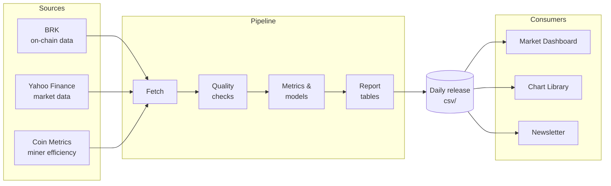

# Bitcoin Report Library

The data engine behind [Secret Satoshis](https://secretsatoshis.com). Every day it pulls
Bitcoin on-chain and market data, calculates the metrics and valuation models, checks the
results, and publishes them as open CSV files.

- **Browse the data:** [secretsatoshis.github.io/Bitcoin-Report-Library](https://secretsatoshis.github.io/Bitcoin-Report-Library/)
- **See it visualized:** [Market Dashboard](https://dashboard.secretsatoshis.com) and [Chart Library](https://charts.secretsatoshis.com)

## What it produces

A daily release of 21 files in `csv/`, listed with checksums in `release_manifest.json`:

| Group | Files |
|-------|-------|
| **Master data** | `master_metrics_data.csv.gz`: every metric, every day since 2010, plus weekly and monthly snapshots |
| **Report tables** | Summary, fundamentals, performance, relative value, ROI, monthly returns, MTD/YTD comparisons |
| **Chart series** | Price models, price paths, drawdowns, cycle lows, halving eras and Bitcoin candles |
| **Outlook** | The annual Bear / Base / Bull price cases |

The [release page](https://secretsatoshis.github.io/Bitcoin-Report-Library/) lists every
file with its date range, size and download link.

## How it works



## Quick start

You need Python 3.12 and [uv](https://docs.astral.sh/uv/).

```bash
git clone https://github.com/SecretSatoshis/Bitcoin-Report-Library.git
cd Bitcoin-Report-Library
uv sync --locked
```

Run the tests:

```bash
uv run --no-sync python -m unittest discover -s tests -t .
```

Build a fresh release from the live sources, then check it:

```bash
uv run --no-sync python main.py
uv run --no-sync python validate_outputs.py
```

`main.py` fetches live data and rewrites `csv/`.

## Project layout

| Path | What's there |
|------|--------------|
| `main.py` | Runs the pipeline end to end |
| `sources.py` | Fetches and merges the data sources |
| `freshness.py` | Decides whether a run is fit to publish |
| `metrics.py`, `cycles.py` | Metrics, valuation models and cycle series |
| `report_tables.py` | The published tables |
| `candle_data.py` | Daily, weekly and monthly candles |
| `data_definitions.py` | Configuration: tickers, series, reference data |
| `validate_outputs.py` | Release checks run before publishing |
| `dashboard/` | The Market Dashboard, a static site built from the release |
| `tests/` | One test file per module |

## Dashboard

`dashboard/` turns each release into the [Market Dashboard](https://dashboard.secretsatoshis.com),
a static site. The Chart Library renderer draws its three interactive charts. You need Node 24.

```bash
cd dashboard
npx --yes npm@12.0.2 ci
npm run sync:local
npm run dev
```

`npm run build` writes the site to `dashboard/build/`. `npm test` and `npm run test:browser`
check it.

## Reading the data

Every file can be read straight from its published URL:

```python
import pandas as pd
base = "https://secretsatoshis.github.io/Bitcoin-Report-Library/csv"
master = pd.read_csv(f"{base}/master_metrics_data.csv.gz", index_col="date",
                     parse_dates=True, low_memory=False)
```

## Daily schedule

GitHub Actions runs the pipeline daily, scheduled for 00:30 UTC. Each run tests the code,
builds and validates the release, and commits it to `csv/`, which GitHub Pages serves. The
dashboard and Chart Library pick up each new release automatically.

## License

[GPL-3.0](LICENSE). The data comes from third-party sources and keeps their terms. The
bundled chart renderer and fonts in `dashboard/static/shared-chart/assets/` keep their own
licenses.
