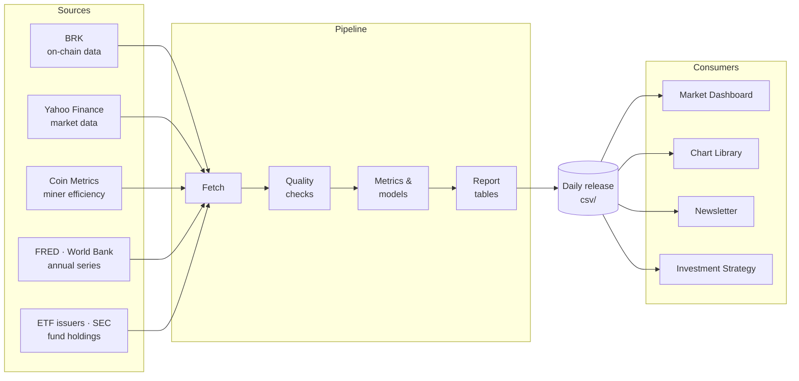

# Bitcoin Report Library

The data engine behind [Secret Satoshis](https://secretsatoshis.com). Every day it pulls
Bitcoin on-chain and market data, US spot bitcoin ETF holdings and a set of annual reference
series, calculates the metrics and valuation models, checks the results, and publishes them as
open CSV files.

- **Browse the data:** [secretsatoshis.github.io/Bitcoin-Report-Library](https://secretsatoshis.github.io/Bitcoin-Report-Library/)
- **See it visualized:** [Market Dashboard](https://dashboard.secretsatoshis.com) and [Chart Library](https://charts.secretsatoshis.com)

## What it produces

A daily release of 28 files in `csv/`, listed with checksums in `release_manifest.json`:

| Group | Files |
|-------|-------|
| **Master data** | `master_metrics_data.csv.gz`: every metric, every day since 2010, plus weekly and monthly snapshots |
| **Report tables** | Summary, fundamentals, performance, relative value, ROI, monthly returns, MTD/YTD comparisons |
| **Chart series** | Price models, price paths, drawdowns, cycle lows, halving eras and Bitcoin candles |
| **Outlook** | The annual Bear / Base / Bull price cases |
| **US spot bitcoin ETFs** | `etf_daily.csv` (each fund's bitcoin held, shares, NAV and flows by trading day), `etf_totals_daily.csv` (all funds, with cumulative flows and the flow-weighted entry price), `etf_quarterly.csv` (holdings and reported cost from each fund's SEC filings) |
| **Annual reference** | `annual_reference_data.csv`: U.S. median household income, world internet use and population, and estimated bitcoin owners, one row per series and year with its source |

The [release page](https://secretsatoshis.github.io/Bitcoin-Report-Library/) lists every
file with its date range, size and download link.

## How it works



## Quick start

You need Python 3.12 and [uv](https://docs.astral.sh/uv/).

```bash
git clone https://github.com/SecretSatoshis/Bitcoin-Report-Library.git
cd Bitcoin-Report-Library
uv sync --locked
```

Run the tests:

```bash
uv run --no-sync python -m unittest discover -s tests -t .
```

Build a fresh release from the live sources, then check it:

```bash
uv run --no-sync python main.py
uv run --no-sync python validate_outputs.py
```

`main.py` fetches live data and rewrites `csv/`.

## Project layout

| Path | What's there |
|------|--------------|
| `main.py` | Runs the pipeline end to end |
| `sources.py` | Fetches and merges the daily data sources |
| `annual_data.py` | Fetches the annual reference series |
| `etf/` | Reads each spot bitcoin ETF's published data and SEC filings, and builds the ETF tables |
| `previous_release.py` | Reads files from the last published release |
| `freshness.py` | Decides whether a run is fit to publish |
| `metrics.py`, `cycles.py` | Metrics, valuation models and cycle series |
| `report_tables.py` | The published tables |
| `candle_data.py` | Daily, weekly and monthly candles |
| `data_definitions.py` | Configuration: tickers, series, reference data |
| `validate_outputs.py` | Release checks run before publishing |
| `dashboard/` | The Market Dashboard, a static site built from the release |
| `tests/` | One test file per module |

## Dashboard

`dashboard/` turns each release into the [Market Dashboard](https://dashboard.secretsatoshis.com),
a static site. The Chart Library renderer draws its three interactive charts. You need Node 24.

```bash
cd dashboard
npx --yes npm@12.0.2 ci
npm run sync:local
npm run dev
```

`npm run build` writes the site to `dashboard/build/`. `npm test` and `npm run test:browser`
check it.

## Data sources

| Source | What | Terms |
|--------|------|-------|
| [BRK](https://bitview.space) | On-chain series and daily candles | BRK's terms |
| [Yahoo Finance](https://finance.yahoo.com) | Stock, ETF, index, futures and dollar-index closes; share counts | Yahoo's terms |
| [Coin Metrics Labs](https://labs.coinmetrics.io) | Monthly network efficiency (J/GH) | Coin Metrics' terms |
| [FRED](https://fred.stlouisfed.org/series/MEHOINUSA646N) / U.S. Census Bureau | U.S. median household income | U.S. government work, delivered under FRED's terms |
| [World Bank](https://data.worldbank.org) | World internet users (% of population) and population | CC BY 4.0 |
| [Our World in Data](https://ourworldindata.org/grapher/number-of-internet-users) | World internet users, 1990–2004, kept by hand | CC BY 4.0 |
| [Crypto.com](https://crypto.com/research) | Yearly estimates of bitcoin owners, kept by hand with each report linked | Crypto.com's terms |
| US spot bitcoin ETF issuers and [SEC EDGAR](https://www.sec.gov/edgar/search/) | Each fund's daily holdings, shares and NAV, collected from 2026-09-30, and its 10-Q and 10-K quarter ends | Each issuer's terms; SEC filings are public |

A fetched annual series that fails to download reuses its rows from the previous release,
which keep their original `retrieved_date`. A series that changes its format, or falls more
than three years behind, stops the release.

The ETF files never stop the release. Each run adds that day's positions to
`etf_snapshots.csv`, carried from release to release. A fund whose site cannot be read that
day is carried forward and marked `carried forward` in `btc_source`; if collection fails
entirely, the previous release's ETF files are republished. Flows are dated by trade day, and
every day before collection began is fitted to the funds' exact SEC quarter-end holdings.

## Reading the data

Every file can be read straight from its published URL:

```python
import pandas as pd
base = "https://secretsatoshis.github.io/Bitcoin-Report-Library/csv"
master = pd.read_csv(f"{base}/master_metrics_data.csv.gz", index_col="date",
                     parse_dates=True, low_memory=False)
annual = pd.read_csv(f"{base}/annual_reference_data.csv")
income = annual[annual.series == "us_median_household_income_usd"].set_index("year")["value"]
```

Daily flows (`*_sum_24h`, such as miner revenue, fees and transfer volume) are UTC
calendar-day totals: the difference between consecutive days of BRK's running totals, which
are published alongside them as `*_cumulative`. Each block counts on exactly one day, unlike
BRK's own `*_sum_24h` series, which are rolling 24-hour windows.

## Daily schedule

GitHub Actions runs the pipeline daily, scheduled for 00:30 UTC. Each run tests the code,
builds and validates the release, and commits it to `csv/`, which GitHub Pages serves. The
dashboard rebuilds from that commit, and once Pages serves the release the run asks the Chart
Library to rebuild.

## License

[GPL-3.0](LICENSE). The data comes from third-party sources and keeps their terms. The
bundled chart renderer and fonts in `dashboard/static/shared-chart/assets/` keep their own
licenses.
